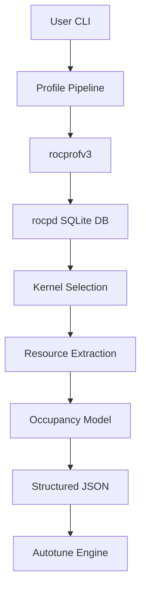
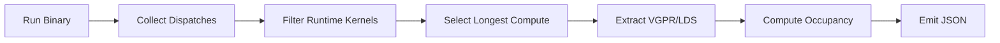
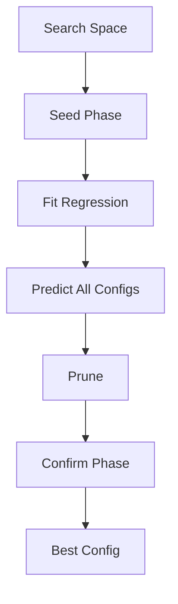

# ROCm Perf Lab


**Hardware-aware performance engineering toolkit for ROCm (AMD GPUs).**

`rocm-perf-lab` provides deterministic kernel profiling, structured JSON output, occupancy modeling, and regression-based autotuning using `rocprofv3`.

Target:
- ROCm 7.x
- RDNA2 (gfx1030) / CDNA2
- rocprofv3 (rocpd SQLite backend)

---

# Features

- ✅ Deterministic kernel profiling
- ✅ rocpd SQLite parsing (ROCm 7.2+ compatible)
- ✅ VGPR / SGPR / LDS extraction
- ✅ Theoretical occupancy modeling
- ✅ Stability analysis (CV classification)
- ✅ Regression-based autotuning with pruning
- ✅ JSON-first CLI
- ✅ Schema validation (versioned output)

---

# Architecture



---

# Profiling Flow



---

# Autotuning Flow



---

# Installation

## Development Install

```bash
python -m venv venv
source venv/bin/activate
pip install -e .
```

Verify:

```bash
rocm-perf --version
```

---

# Usage

## Profile

```bash
rocm-perf profile ./kernel
```

JSON output:

```bash
rocm-perf profile ./kernel --json
```

Quiet scripting mode:

```bash
rocm-perf profile ./kernel --quiet
```

Disable rocprof:

```bash
rocm-perf profile ./kernel --no-rocprof
```

---

## Autotune

```bash
rocm-perf autotune \
  --space search_space.json \
  --cmd-template "./kernel --bm {BLOCK_M} --bn {BLOCK_N}"
```

---

# Example JSON Output

```json
{
  "schema_version": "1.0",
  "kernel": {"name": "my_kernel"},
  "gpu": {"architecture": "rdna2"},
  "runtime_ms": 0.012,
  "stability": {"cv": 0.03},
  "resources": {"vgpr_per_thread": 16},
  "occupancy": {"theoretical": 0.75}
}
```

---

# Stability Model

CV classification:

- ≤ 0.05 → stable
- ≤ 0.10 → moderate
- > 0.10 → unstable

---

# Autotune Guarantees

- No double profiling
- Static-feature pruning only
- Low R² warning if model unreliable

---

# Schema

Profile output validated against Pydantic model.

Current version:

```
schema_version = "1.0"
```

---

# Roadmap

- Counter-based roofline integration
- Stability gating in autotune
- Caching repeated configs
- PyPI release

---

# License

TBD
